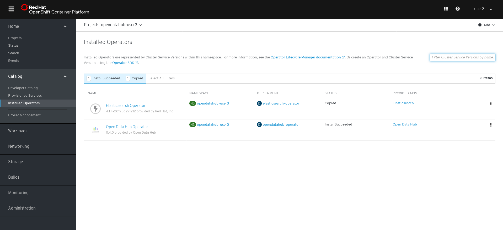
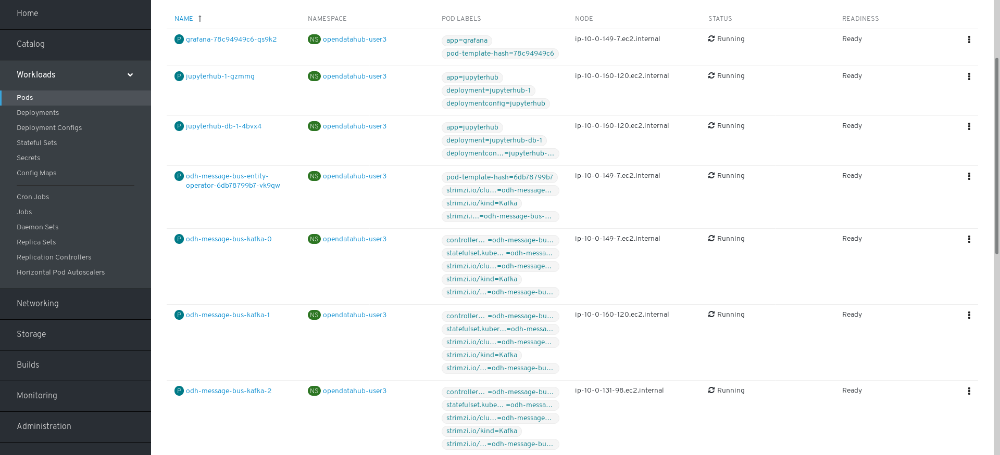
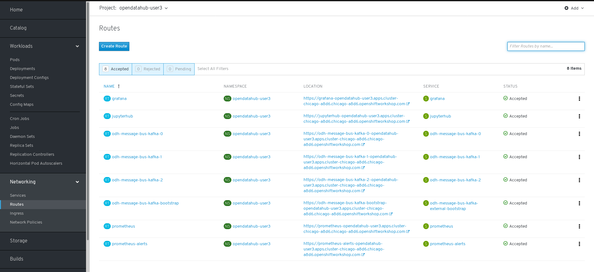
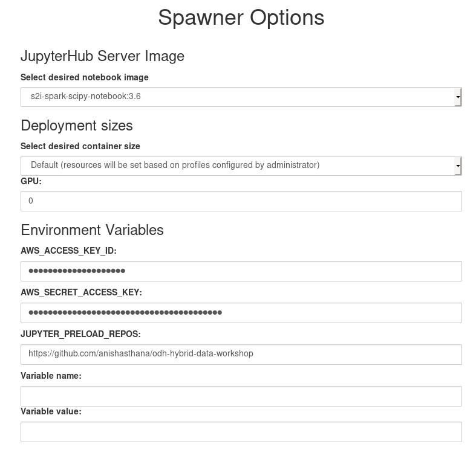
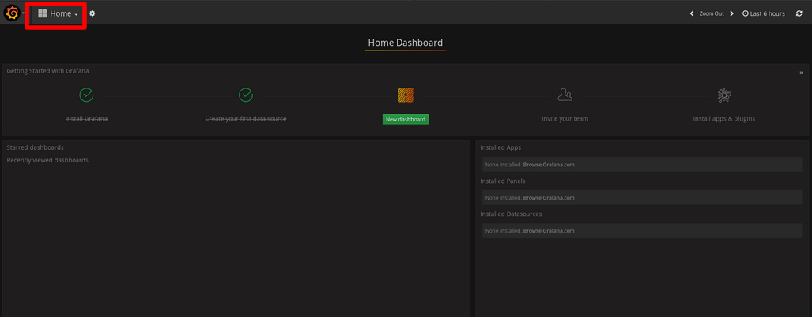
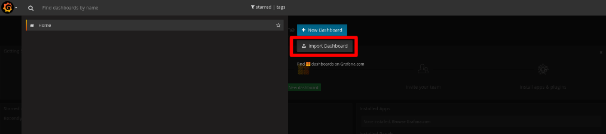

# Open Data Hub Basic Tutorial

This tutorial is intended as part of an interactive in-person workshop and will show users how to use the Open Data Hub and Ceph to analyze data using machine learning algorithms.

## Prerequisites

The following has been provided for you as prerequisites for the workshop tutorial:

- A running OpenShift cluster.
- An installed Open Data Hub operator in the OpenShift cluster.
- A project space in OpenShift for deploying and managing Open Data Hub.

## Deploying Open Data Hub to Your OpenShift Project Space

In order to get started with the Open Data Hub, you need to deploy it into your project namespace.

1. Go to the OpenShift console login page provided on your handout.

2. Enter the Attendee ID and Password on your handout provided during the workshop to log into OpenShift.

3. After logging in, go to your list of projects by clicking on `Home -> Projects`.  Click on the project with your Attendee ID to open that project namespace. Ex. user250.  This will take you to the project status page.

4. Now you can deploy the Open Data Hub into your project.  On the left side menu, go to `Catalog -> Installed Operators`.  This will display a list of installed operators to deploy.  Find and click on `Open Data Hub Operator`.
 

5. Once the Open Data Hub operator is selected, click on `Open Data Hub` in the top bar, and then the blue `Create Open Data Hub button`.

6. The Open Data Hub Custom Resource (CR for short) will be displayed. The CR is used to configure the deployment of the ODH that the operator will spin up. For the purposes of the workshop, you do not need to make any changes to the YAML file. Click on `Create` to deploy the Open Data Hub components and wait until the deployment is complete.

7. It will take a while for all of the Open Data Hub components to start up.  To ensure all pods of the Open Data Hub are deployed successfully, click on `Workloads -> Pods` on the left menu. Wait until all pods should show `Ready` in the Readiness column. This should take about 5 minutes to complete.

8. If you want to get an overview of the different pods, services, and routes that the Operator deploys, you can go to `Catalog -> Installed Operators`, and then click on `Open Data Hub`. Under `Open Data Hub`, you can find and click on `example-opendatahub` and view the individual bits and pieces of the deployment under the `resources` tab.

9. Now you can start data science work in JupyterHub.  To do so, first you need to find the link to your JupyterHub.  Click on `Networking -> Routes` in the left menu.  Then click on the link to JupyterHub.  This is where you will run the rest of the tutorial.

## Running Jupyter Notebooks in OpenShift

1. Once you've opened JupyterHub from the link, you'll notice that you don't have SSL certificates properly set up for certificate authorization.  This will cause a warning to be displayed in your browser. You will need to use Private Browsing in Safari or Incognito Mode in Chrome, or click on the `Proceed` link.  If you are using FireFox, you can use the default mode but you will need to add a security exception by going to on `Advanced -> Add Exception... -> Confirm Security Exception` when the security warning displays in the browser. To log in, you will use the same credentials that you used to log into the OpenShift cluster.

2. When accessing JupyterHub for the first time after getting past the security warning, it prompts the following:

            Authorize Access
            Service account jupyterhub-hub in project opendatahub-user14 is requesting permission to access your account (user14)
            Requested permissions
            user:info
    This is just Jupyter Hub's authentication system asking for permission to get access to the user:info data. The user needs to select "Allow selected permissions"

3. JupyterHub is used in the Open Data Hub for spawning Jupyter notebook servers with pre-installed tools for creating AI and machine learning models. For more information on Jupyter notebooks, visit [https://jupyter.org/](https://jupyter.org/). Once logged in, click on `Start my Server`. You will be redirected to a page with a number of prefilled/ selected fields. You don't need to change any settings -- just hit the `Spawn button`. This may take a few moments to complete and you will be redirected to a Jupyter notebook server. The default settings are as follows.

4. Open the `hybrid-data-engineering.ipynb` notebook by clicking on it. It can be found under `odh-hybrid-data-workshop/source/Notebooks/` This will open the notebook in Jupyter.  The notebook will contain the rest of the instructions for the tutorial.

5. Notebooks contain *cells*.  Run each cell in your notebook by clicking on the `>| Run` button or hitting `Shift+Enter` for each cell, starting with the first.  When a cell is actively running, it will have `[*]` on the side.  Some cells will take time to run.  Once done, it will have a number, such as `[1]`.  You can go through the entire notebook until all cells are run.

## Streaming Data and Monitoring Infrastructure

1. The `/source/Notebooks/` folder contains two other notebooks called `Kafka Consumer` and `Kafka Producer`. Open both of them and change <PROJECT_NAME> to the name of your project in the OpenShift Console. Then you can start running the cells in both of them. Leave the cells running. The producer notebook is simply writing to the Kafka cluster deployed by the ODH Operator on a sample topic, whereas the consumer is constantly reading all the messages that are written there.

2. Once you have started running the Kafka notebooks, go back to the OpenShift console. Under `Networking -> Routes`, find the route named `Grafana` and click on it.

3. Download Spark Metrics.json found under `source/Dashboards/` to your local environment. Now, click on the `Home` button towards the top-left of the Grafana landing page.

4. Finally, click on `Import Dashboard -> Upload.json File` and upload Spark Metrics.json to see how metrics changed over time as the notebooks ran.

5. Follow the instructions to create the Kafka dashboard. The final result of the dashboard can be found under `/source/Dashboards/Kafka.json`

6. That's it!  Thank you for participating in this tutorial.  If you have questions or would like to contribute to the Open Data Hub project, you can find us at [https://opendatahub.io/community.html](https://opendatahub.io/community.html).
